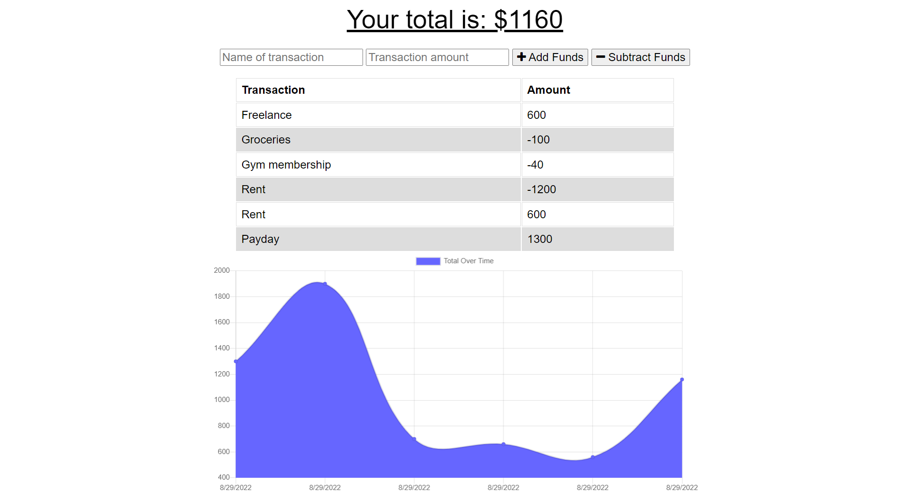
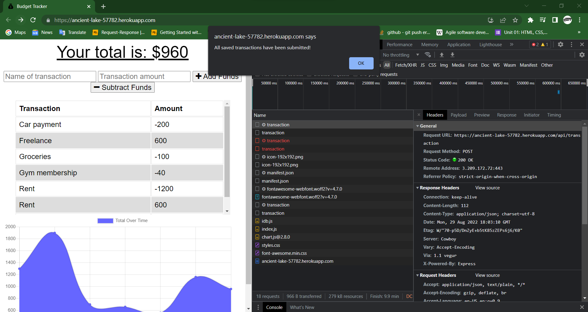
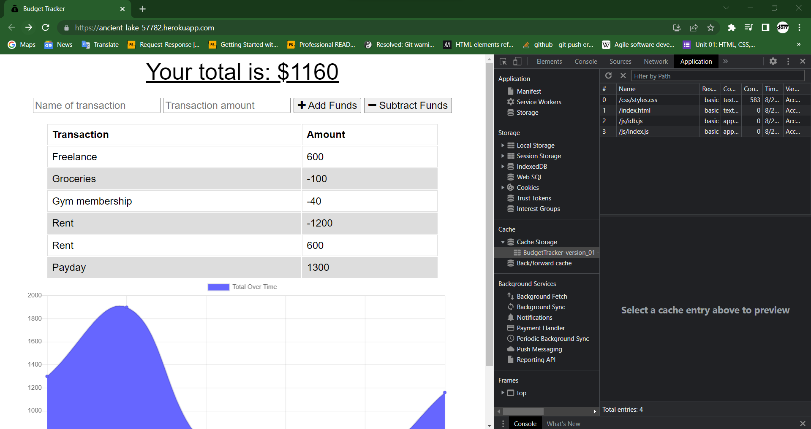

# Budget Tracker
## Description
A budget tracker application that has been updated so that users can input expenses and deposits with or without a data/internet connection.
## Table of Contents
- [Installation](#installation)
- [Links](#links)
- [Screenshots](#screenshots)
- [Usage](#usage)
- [License](#license)
- [How to Contribute](#how-to-contribute)
- [Questions](#questions)
## Installation
Access the GitHub repository 'budget-tracker' to fork and clone the repository.

Install necessary dependencies using:
````````````
npm install
````````````
## Links
- [GitHub Repository](https://github.com/dashley2/budget-tracker.git)
- [Deployed Application](https://ancient-lake-57782.herokuapp.com/)
## Screenshots
Deployed Application:

Offline functionality:

Application cache:

## Usage
The deployed application can be accessed with the heroku link detailed above. To run the server from localhost:3001 use `node server.js` or `npm start`.
## License
The badge at the top of the page shows that this project is licensed under MIT. The link for that license is shown below.
- [License: MIT](https://opensource.org/licenses/MIT)
## How to Contribute
Please feel free to fork and clone the repository. Push changes to your fork, and then make a pull request to add to the current repository.
## Questions
Please direct any questions to a.darrmedia@gmail.com. To see more projects, visit the link below for dashley2's respository:
- [GitHub Repository](https://github.com/dashley2)